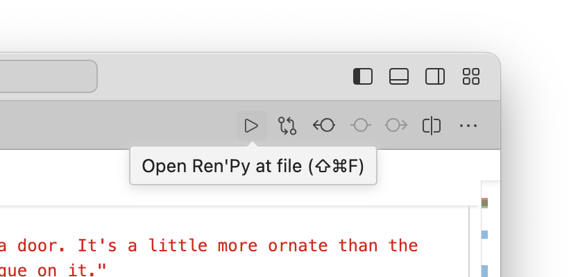
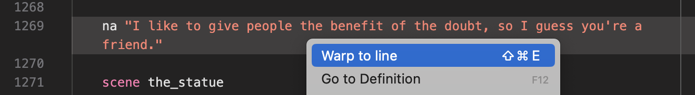
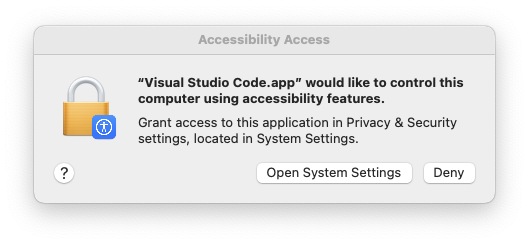

# Ren'Py Launch and Sync

Launch and sync your Ren'Py game at the current line directly from inside Visual
Studio Code.

## Features

-   Start and quit your Ren'Py game directly from Visual Studio Code
-   Warp games to a specific line, or jump to a label
-   Move cursor position in Visual Studio Code as dialogue progresses with the
    _Follow Cursor_ mode
-   Automatically enable autoreload when files change (with a setting)
-   Can discover and bind to games that were started outside of Visual Studio
    Code

## Commands

The extension provides many commands to interact with Ren'Py. You probably want
to know about the following:

| Command                                       | Shortcut                                     | Shortcut (Mac)                             |
| --------------------------------------------- | -------------------------------------------- | ------------------------------------------ |
| Start Ren'Py project                          | <kbd>Alt</kbd>+<kbd>Shift</kbd>+<kbd>L</kbd> | <kbd>⌘</kbd>+<kbd>Shift</kbd>+<kbd>L</kbd> |
| Open Ren'Py at the current line               | <kbd>Alt</kbd>+<kbd>Shift</kbd>+<kbd>E</kbd> | <kbd>⌘</kbd>+<kbd>Shift</kbd>+<kbd>E</kbd> |
| Open Ren'Py at the current file               | <kbd>Alt</kbd>+<kbd>Shift</kbd>+<kbd>F</kbd> | <kbd>⌘</kbd>+<kbd>Shift</kbd>+<kbd>F</kbd> |
| Open Ren'Py at label                          | <kbd>Alt</kbd>+<kbd>Shift</kbd>+<kbd>J</kbd> | <kbd>⌘</kbd>+<kbd>Shift</kbd>+<kbd>J</kbd> |
| Toggle: Warp to selected line as cursor moves | <kbd>Alt</kbd>+<kbd>Shift</kbd>+<kbd>C</kbd> | <kbd>⌘</kbd>+<kbd>Shift</kbd>+<kbd>C</kbd> |

### Triggers

The commands can be triggered in several ways:

1. By using title bar run menu 
2. By using the right click context in an editor 
3. By using the right click context menu in the file explorer
   
4. By using the status bar 
5. By opening the command palette and typing the command, i.e.
   `Renpy: Open Ren'Py at current line`
6. Via keyboard shortcut ([see here](#commands))

## Configuration

You must set <code codesetting="renpyWarp.sdkPath">renpyWarp.sdkPath</code> to a
directory where the Ren'Py SDK can be found. If you haven't done so, a prompt
will appear to inform you to set it.

### Strategy

You may want to customize what to do with an open Ren'Py instance when a new
command is issued. In Renpy Launch and Sync, this is called a "strategy".

The strategy is controlled with the setting
<code codesetting="renpyWarp.strategy">renpyWarp.strategy</code>, which can be
set to one of the following values:

<dl>
   <dt><strong>Update Window</strong></dt>
   <dd>
      

         When a command is issued, replace an open editor by sending a
         <code>renpy.warp_to_line()</code> command to the currently running 
         Ren'Py instance
      

   </dd>
   <dt><strong>New window</strong></dt>
   <dd>
      Open a new Ren'Py instance when a command is issued
   </dd>
   <dt><strong>Replace window</strong></dt>
   <dd>
      Kill the currently running Ren'Py instance and open a new one when a 
      command is issued
   </dd>
</dl>

### Follow Cursor

Renpy Launch and Sync can keep its cursor in sync with the Ren'Py game. The
direction of this sync can be controlled with the setting
<code codesetting="renpyWarp.followCursorMode">renpyWarp.followCursorMode</code>

<dl>
   <dt><strong>Ren'Py updates Visual Studio Code</strong></dt>
   <dd>
      The editor will move its cursor to match the current line of dialogue in 
      the game.
   </dd>
   <dt><strong>Visual Studio Code updates Ren'Py</strong></dt>
   <dd>
      Ren'Py will warp to the line being edited. Your game must be compatible
      with warping for this to work correctly.
   </dd>
   <dt><strong>Update both</strong></dt>
   <dd>
      Try and keep both in sync with each other. Because of how warping works, 
      this can be a bit janky, causing a feedback loop.
   </dd>
</dl>

Cursor syncing can be turned on by default with the setting <code codesetting="renpyWarp.followCursorOnLaunch">renpyWarp.followCursorOnLaunch</code>.

### Focus Window on Warp

When a warp occurs, you may want the Ren'Py window to be focused. This can be
configured with the setting
<code codesetting="renpyWarp.focusWindowOnWarp">renpyWarp.focusWindowOnWarp</code>.

You might be prompted to allow Visual Studio Code to control other applications
when this setting is enabled. After allowing this, restart Visual Studio Code to
apply the changes.

## Troubleshooting

In order to use the current line/file feature, your game must be compatible with
warping as described in
[the Ren'Py documentation](https://www.renpy.org/doc/html/developer_tools.html#warping-to-a-line).
This feature has several limitations that you should be aware of, and as such
may not work in all cases.

## Attribution

The icon for this extension is a cropped rendition of the Ren'Py mascot, Eileen,
taken from [the Ren'Py website](https://www.renpy.org/artcard.html).
